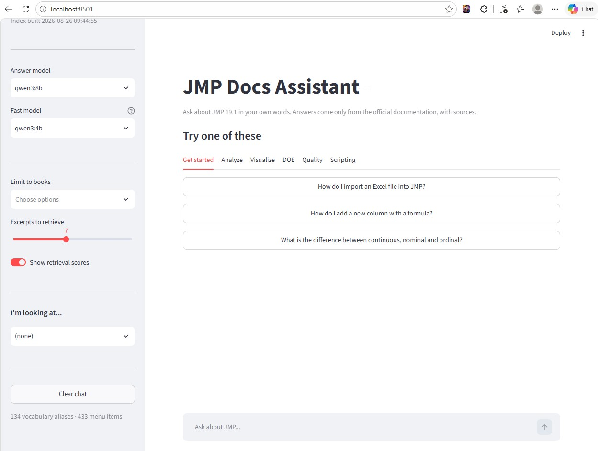
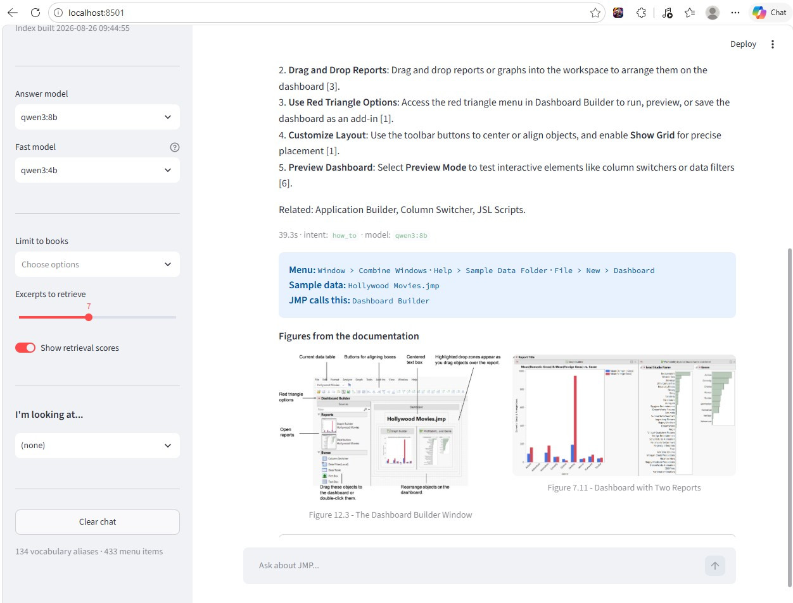

# jmp-docs-mcp

**Ask JMP's documentation a question in your own words. Get the menu path, the steps, and a link to the page it came from.**

An MCP server + chat app over all 3,864 pages of the JMP 19.1 documentation. Runs entirely on your own machine — no API keys, no per-question cost, nothing leaves your laptop.

[](LICENSE)




---

## The problem

[JMP](https://www.jmp.com) is statistical software used heavily in semiconductor fabs, pharma, chemicals and manufacturing — for design of experiments, SPC, capability studies, reliability analysis and data exploration.

It also has **3,864 pages of documentation across 20 books**, and finding anything in it is harder than it should be:

- **JMP is GUI-driven**, so the answer you need is usually *a place* — a menu path and a sequence of clicks — not a code snippet.
- **Many users are occasional users.** An engineer who runs a designed experiment twice a year knows the statistics cold but can't remember where JMP keeps the feature.
- **JMP names things its own way.** This is the real problem.

That last point isn't a guess. Measured against the actual corpus:

| The page that answers the question | What a user types | Times that phrase appears on that page |
|---|---|---|
| `bootstrap-forest.shtml` | "random forest" | **0** |
| `boosted-tree.shtml` | "gradient boosting" | **0** |
| `oneway-analysis.shtml` | "ANOVA" | 2 |

Ask a normal RAG system *"how do I run a random forest in JMP?"* and it finds **nothing useful**. There's no keyword overlap, and embeddings are unreliable at bridging product names. The answer is right there in the docs — the words just don't match.

**Closing that gap is what this project is.**

---

## What you get

Ask in your words. Get JMP's answer, with the menu path first.

> **You:** How do I run a random forest in JMP?
>
> **Assistant:**
> **Analyze > Predictive Modeling > Bootstrap Forest**
> *(JMP calls this a Bootstrap Forest.)*
>
> 1. Open your data table.
> 2. Select **Analyze > Predictive Modeling > Bootstrap Forest**.
> 3. Select the response variable and click `Y, Response`.
> 4. Select the predictor variables and click `X, Factor`.
> 5. Set the `Validation Portion` (e.g. 0.25).
> 6. Click `OK`.
>
> **Sources:** Bootstrap Forest · Launch the Bootstrap Forest Platform

Answers include the menu path, the sample data table to use, and the real figures from the documentation:



And when the docs genuinely don't cover something, it says so instead of inventing a menu:

> **You:** How do I train a YOLO object detection model in JMP?
>
> **Assistant:** The provided documentation excerpts do not cover training a YOLO object detection model in JMP. JMP does not support deep learning frameworks for object detection…

---

## How it works

```
  your question
       │
       ├─ 1. translate    "random forest"  →  "Bootstrap Forest"
       ├─ 2. classify     how-to? interpret? scripting?
       ├─ 3. retrieve     semantic search (FAISS) + keyword search (BM25)
       ├─ 4. rank         prefer the page type that matches your intent
       └─ 5. answer       local LLM, citations, figures
```

Four pieces do the work, each built from something JMP already publishes:

**1. Vocabulary bridge** — 134 entries, 478 user terms. `random forest → Bootstrap Forest`, `pivot table → Tabulate`, `VLOOKUP → Join`, `Cpk → Process Capability`. Applied twice: the synonyms are baked into the keyword index so search can match words the page never contains, *and* JMP's terms are injected into the query. Worth **+13.9 points of recall**.

**2. UI element map** — 3,475 entries. JMP ships a hidden context-help map linking on-screen element names to exact doc sections. Parsed out and exposed as the `whats_this` tool.

**3. Menu reference** — 433 menu items, parsed from JMP's own menu documentation. So "where do I click?" gets an authoritative answer, not a regex guess.

**4. Intent routing** — 8 intents. *"How do I run a Partition?"* returns **Launch the Partition Platform**. *"How is the Partition split computed?"* returns **Statistical Details**. Same topic, different need.

---

## Quickstart

**You need:** Python 3.11+, [Ollama](https://ollama.com/download), ~8 GB free disk.

```bash
git clone https://github.com/nepseli/jmp-docs-mcp.git
cd jmp-docs-mcp
```

**1 — Install**

```powershell
python -m venv .venv
.\.venv\Scripts\python.exe -m pip install -e ".[dev]"
```

**2 — Get the model**

```bash
ollama pull qwen3:8b
```

**3 — Build the index** (one time, ~70 min, unattended)

```powershell
.\.venv\Scripts\python.exe scripts\build_corpus.py
.\.venv\Scripts\python.exe scripts\build_index.py
```

Downloads 3,864 pages and 4,251 figures (~15 min, resumable — interrupt it freely), then embeds them (~46 min). For a faster build, set `index.embed_model: BAAI/bge-small-en-v1.5` in `config.yaml`.

> **If your clone is inside OneDrive / Dropbox / iCloud**, move the data directory somewhere unsynced first — 7,000 files will otherwise churn your sync client on every rebuild. Copy `.env.example` to `.env` and set `JMPDOCS_PATHS__DATA_DIR`.

**4 — Run**

Double-click **`Start JMP Docs.bat`**, or:

```powershell
.\Start-JmpDocs.ps1
```

Open **http://localhost:8501**. Use `-Status` and `-Stop` to manage it.

<details>
<summary><b>macOS / Linux (untested)</b></summary>

The Python is cross-platform; only the launcher scripts are Windows-specific.

```bash
python3 -m venv .venv && ./.venv/bin/python -m pip install -e ".[dev]"
./.venv/bin/python scripts/build_corpus.py
./.venv/bin/python scripts/build_index.py
./.venv/bin/python -m streamlit run src/jmpdocs/app.py
```

Not executed by the author — reports welcome.
</details>

---

## Using it as an MCP server

The chat app is the demo. **The MCP server is the part that scales**, because MCP is a protocol — not a Claude feature. Any MCP-capable agent can use these tools.

### The 10 tools

| Tool | Answers |
|---|---|
| `search_jmp_docs` | General questions, with citations |
| `whats_this` | "What is this thing on my screen?" |
| `find_menu_path` | "Where do I click?" |
| `get_jmp_page` | Full text of one page |
| `find_example` | Worked examples, optionally by sample data table |
| `find_jmp_figures` | Dialog screenshots, by caption |
| `list_jmp_books` · `browse_jmp_toc` | Structure navigation |
| `jmp_fetch_live` | Bypass the index, fetch fresh from jmp.com |
| `index_stats` | What's indexed, and when |

### In Claude Desktop or Claude Code

Copy the `jmp-docs` block from [`claude_desktop_config.example.json`](claude_desktop_config.example.json) into your `claude_desktop_config.json`, fix the paths, restart. Now you can ask JMP questions while writing JSL, without leaving your editor.

### Inside a larger agent

This is where it gets useful. The tools return **structured JSON with source URLs**, not prose — they're built to be consumed by a machine that may want to verify, chain or combine them.

Load them into any LangGraph agent with `langchain-mcp-adapters`:

```python
from langchain_mcp_adapters.client import MultiServerMCPClient
from langgraph.prebuilt import create_react_agent
from langchain_ollama import ChatOllama

client = MultiServerMCPClient({
    "jmp-docs": {
        "command": "/path/to/jmp-docs-mcp/.venv/bin/python",
        "args": ["-m", "jmpdocs.mcp_server"],
        "transport": "stdio",
    }
})

tools = await client.get_tools()
agent = create_react_agent(ChatOllama(model="qwen3:8b"), tools)
```

Patterns this unlocks:

- **A manufacturing copilot.** Give one agent this server *plus* your MES or data warehouse. It can pull yesterday's yield data, notice the Cpk dropped, and look up how to build the capability report — in a single conversation.
- **A JSL coding agent.** Pair with a filesystem server so the agent reads your script, looks up the message syntax it needs here, and writes the fix.
- **A supervisor routing to specialists.** In a multi-agent setup, this becomes the "JMP knowledge" node the supervisor delegates documentation questions to.
- **Onboarding automation.** A scheduled agent that answers new-starter JMP questions in Slack, citing the official docs every time.

For networked deployments, `--http` serves streamable-HTTP instead of stdio:

```bash
python -m jmpdocs.mcp_server --http --host 0.0.0.0 --port 8000
```

---

## Why local models

Running on Ollama is a design choice, not a compromise.

**Your questions never leave the machine.** JMP's heaviest users work in semiconductor, pharma and defence-adjacent manufacturing, where pasting anything into a hosted chatbot is a policy violation. Even a question like *"why is my Cpk dropping on the etch process"* leaks intent. Local inference removes the problem entirely — nothing to review, nothing to get approved.

**Zero marginal cost.** After the one-time build, every question is free forever. Share it with 40 engineers; the cost doesn't change.

**It works offline.** On a fab floor, in a validation lab, on a plane.

**Nothing gets deprecated underneath you.** The model is a file you control. Same index + same model + temperature 0.1 gives the same answer next quarter — which matters if you're citing documentation in a validation report.

The trade is **speed**: 45–60 s per answer on CPU, versus 2–5 s from a hosted API. See [Limitations](#limitations).

### Why Qwen 3 specifically

The job here is narrow: *read these six documentation excerpts and rewrite them as numbered steps with citations.* It is not open-ended reasoning — retrieval already did the hard part. That shapes what matters in a model.

| Requirement | Why Qwen 3 fits |
|---|---|
| **Truly free to use** | Apache 2.0. Llama's licence has usage conditions that make corporate legal teams pause; Qwen's doesn't. |
| **Follows format instructions** | The intent templates demand a specific shape — menu path first, then numbered steps, then citations. Qwen 3 holds that structure reliably at 8B, which many same-size models don't. |
| **Faithful to source** | It summarises the excerpts rather than drifting into its own knowledge — exactly what you want when hallucinating a menu path is the worst failure mode. |
| **Fits in memory** | ~5 GB alongside the 440 MB embedder, comfortable on a 16 GB machine. |
| **Scales without code changes** | Ships as 0.6b / 1.7b / 4b / 8b / 14b / 32b. Got a GPU? Change one config line to `qwen3:14b`. |

**`qwen3:8b` is the answer model.** `qwen3:4b` is configured in the fast-model slot for query rewriting, but **that path is off by default** — measured on this hardware, it ignored both `reasoning=False` and `/no_think`, spent 30+ seconds emitting chain-of-thought prose instead of search queries, and produced worse results than the free deterministic fallback. It's kept as a config option for when a better small model is available.

Other models work — `llama3.1:8b`, `mistral-nemo`, `gemma3` — change `llm.answer_model` and restart. Nothing in the code is Qwen-specific.

> **Historical note:** the project originally targeted `gpt-oss:20b`. The local model blob turned out to be corrupt (it failed to load on two Ollama versions with a tensor size overflow), and switching to `qwen3:8b` turned out to be the better choice for CPU inference anyway.

---

## Results

36 golden questions, written in **user vocabulary** rather than documentation vocabulary. A test set phrased the way the docs phrase things would score near-perfect and prove nothing.

| Configuration | Recall@6 | MRR | Latency |
|---|---|---|---|
| **Default** | **97.2 %** | **0.843** | 0.44 s |
| Without the vocabulary bridge | 83.3 % | 0.657 | 0.41 s |
| With cross-encoder reranking | 97.2 % | 0.831 | 4.32 s |

Intent classification: **100 %** (14/14). Tests: **110 passed, 1 xfailed**.

Two findings worth recording, because both contradicted the original design:

**The vocabulary bridge is the most valuable component** — +13.9 points overall. On bridge-specific questions it lifts recall from 73 % to 93 %.

**The cross-encoder reranker earns nothing.** Same recall, slightly *worse* ranking, ~10× the latency. It's off by default. It only looked essential until a scoring bug was found: BM25 scores aren't comparable across queries, so normalising the pooled scores once let a long question drown out the short alias query carrying the bridge. Normalising per query moved recall from 86.1 % to 97.2 % on its own.

One test is a **deliberate failure**: JMP has no deduplication feature, so *"how do I remove duplicate rows?"* has no page to find. It's marked `known_gap` and xfailed rather than deleted — hiding it would hide a real documentation gap.

```powershell
.\.venv\Scripts\python.exe scripts\eval_retrieval.py              # score it
.\.venv\Scripts\python.exe scripts\eval_retrieval.py --no-alias   # ablate the bridge
.\.venv\Scripts\python.exe -m pytest                              # full suite
```

---

## Configuration

`config.yaml` holds the defaults. Override any value with an environment variable using the `JMPDOCS_` prefix and `__` for nesting:

```bash
JMPDOCS_LLM__ANSWER_MODEL=qwen3:14b
JMPDOCS_RETRIEVAL__K_FINAL=8
```

| Setting | Default | Change it when |
|---|---|---|
| `llm.answer_model` | `qwen3:8b` | You have GPU headroom → `qwen3:14b` |
| `index.embed_model` | `BAAI/bge-base-en-v1.5` | You want a ~3× faster build → `bge-small` |
| `retrieval.rerank` | `false` | Retrieval is missing things and you'll accept the latency |
| `llm.num_predict` | `420` | Answers are getting truncated |

**New JMP release?** Point `source.version` and `source.base_url` at it and re-run both build scripts. The crawler is cache-backed, so only changed pages refetch.

### Project layout

```
src/jmpdocs/
  ingest/       toc · crawl · parse · menus · images · build_index
  knowledge/    aliases.yaml (the bridge) · intent taxonomy
  retrieval/    store · hybrid search
  graph/        LangGraph pipeline · intent-specific prompts
  mcp_server.py FastMCP, 10 tools
  app.py        Streamlit chat
scripts/        build_corpus · build_index · eval_retrieval · refresh
eval/           golden_questions.yaml
tests/          111 tests
```

**Stack:** LangGraph · LangChain · FastMCP · FAISS · rank-bm25 · sentence-transformers (BGE) · Streamlit · Ollama

---

## Ideas for improvement

Roughly ordered by value per unit of effort.

**Make the vocabulary bridge self-extending.** It's hand-authored — the one component that can't be derived from the site. Logging queries that retrieve nothing confident would surface missing aliases automatically, turning usage into a growth loop.

**GPU inference.** The biggest user-visible win. Answers drop from ~50 s to 3–5 s with no code change. This was built on a machine with a 2 GB integrated GPU, which is why CPU numbers dominate here.

**Make figures searchable.** Images are display-only today. Running a vision model over the 4,251 screenshots once at build time would let you find "the dialog with the Validation Portion field" by content, not just caption.

**Answer caching.** Docs are static and engineers ask overlapping questions. A semantic cache would make repeat asks instant and compound across a team.

**Cross-version diffing.** Index two JMP releases and answer "what changed in DOE between 18 and 19?" — a question the official docs answer poorly and that matters at every upgrade.

**A bigger evaluation set.** 36 questions catches regressions but is thin for tuning; differences under ~5 points are noise. A few hundred, harvested from real JMP community threads, would let the weights be tuned rather than reasoned about.

**Verify generated JSL.** Scripting answers look right but are untested. Running them against a real JMP instance and feeding errors back would close the loop.

**Index the JMP User Community.** Official docs describe features; community threads solve problems. Both, clearly labelled by source, would cover the questions the manual doesn't.

---

## Limitations

Stated plainly, because they're real.

**Answers take 45–60 seconds.** The big one. On CPU, prompt evaluation runs ~55 tok/s and generation ~8 tok/s — generation dominates. The first question of a session adds ~12 s of model loading, and the app needs ~20 s on first load to memory-map the index, during which the sidebar is missing and it looks half-broken. A GPU fixes this. If you want speed above all, this is the wrong architecture.

**Answer quality is capped by an 8B model.** Retrieval does the heavy lifting and the model summarises, which suits a documentation assistant. It won't design your experiment or interpret your results the way a statistician would. It will not tell you *whether* a Bootstrap Forest is the right choice.

**The vocabulary bridge is finite.** 134 entries cover common cases. Ask about something outside it in non-JMP terms and you'll get the same miss a plain RAG would. It's designed to be extended — one YAML line, asserted by the tests — but it doesn't extend itself.

**It only knows JMP 19.1, and only what's documented.** Nothing about older versions, add-ins, or community solutions. Where the docs have gaps, so does this.

**Retrieval is strong but not proven at scale.** 97.2 % recall on 36 questions authored by the same person who built the system. An independent, larger set would be a fairer test.

**Figures are shown, never analysed.** A screenshot that perfectly answers your question won't be *found* unless its caption matches.

**Windows-verified only.** The Python should run anywhere; the launchers are PowerShell and batch.

**It's a personal project, not a product.** No auth, no multi-user isolation, no support commitment. Single-user localhost is the design point.

---

## Legal

This is an independent, unofficial tool. It is **not affiliated with, endorsed by, or sponsored by JMP Statistical Discovery LLC or SAS Institute Inc.** "JMP" is a trademark of JMP Statistical Discovery LLC.

The ingestion pipeline downloads JMP's publicly accessible documentation at build time (their `robots.txt` permits crawling; the crawler is rate-limited and polite). **That content belongs to JMP and is not redistributed here** — the crawled corpus, figures and index are excluded from version control and must stay that way. Each user builds their own index, and every answer cites and links back to the official page.

If you represent JMP and would like something changed, please open an issue.

## License

MIT — see [LICENSE](LICENSE). Covers the source code only, not the JMP documentation it retrieves.
